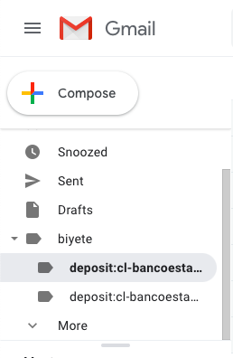
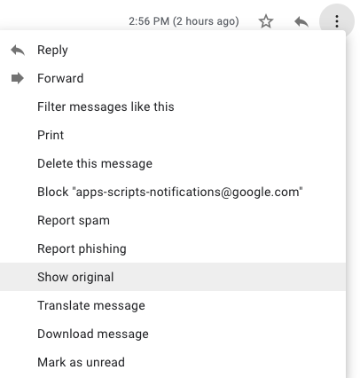

:ext-relative:
:toc: macro
:toclevels: 3

# Developers

This document presents information relevant to people who want to contribute code.
Please read first link:CONTRIBUTING.adoc{ext-relative}[CONTRIBUTING] document for general guidelines.

toc::[]

## Environment Setup

This project is made using https://nodejs.org/en/[_Node JS_]. A link:Dockerfile{ext-relative}[Dockerfile] is provided with the required environment. But a traditional environment installation can be used too.

### Dependencies

- https://prettier.io/ for automatic code formatting.
- https://standardjs.com/ for code linting.
- https://jestjs.io/ for testing.
- https://github.com/developit/microbundle for bundling.
- https://en.wikipedia.org/wiki/Makefile for centralized command runner.
- https://asciidoc.org/ for docs.
- https://git-scm.com/ for version control.
- https://github.com/commitizen/cz-cli for standarized commit messages.
- https://yarnpkg.com/ preferred package manager.

- (optional) https://www.docker.com/ for node env.

### Code Editors

You can use any editor that supports link:.editorconfig{ext-relative}[.editorconfig] files.

Recommendations:

- https://vscodium.com/
- https://neovim.io/
- https://www.spacemacs.org/

## Organization

This codebase tries to follow https://en.wikipedia.org/wiki/Domain-driven_design[Domain Driven Design] practices and https://en.wikipedia.org/wiki/SOLID[SOLID] principles.

The main domains are: 

- `parsers`: Parse email's content with specific regex rules.
- `actions`: Refers to some action to take after parsing emails (Ex: Save to Spreadsheet).

## Directory: plugins

This directory contains the different `actions` and `parsers`. These are the important domains:

- `country`: Directory that holds different entities specific to a country. This is because the same entity (Ex: "_Netflix_") could have different email formats depending on the country of the customer. Country names should be in lowercase and in USA english. No spaces (use dash to separate words).

- `any`: Directory refers to `actions` and `parsers` that could be applied to _any_ country/entity. `actions` will be applied on every email found.

- `entity`: Directory that contains `actions` and `parsers` specific to the entity. An entity could be any organization. Example banks, subscription services and other money related emails. `actions` will only be applied to emails related to this entity.

*Example Structure*

```sh
$ tree -L 6 plugins
plugins
├── any
│   ├── actions
│   │   ├── index.js
│   │   └── spreadsheet
│   │       ├── Constants.js
│   │       ├── SpreadSheetAction.js
│   │       └── index.js
│   ├── index.js
│   └── parsers
│       └── index.js
├── chile # country
│   ├── currencies
│   │   ├── CLP.js
│   │   └── index.js
│   ├── entities
│   │   ├── bancoestado # entity
│   │   │   ├── README.adoc
│   │   │   ├── actions
│   │   │   │   └── index.js
│   │   │   ├── index.js
│   │   │   ├── parsers
│   │   │   │   ├── BancoEstadoPurchaseNotificationParser.js
│   │   │   │   ├── BaseBancoEstadoParser.js
│   │   │   │   └── index.js
│   │   │   └── test
│   │   │       └── BancoEstadoPurchaseNotificationParser.test.js
│   │   └── index.js
│   └── index.js
└── index.js
```

## Directory: lib

This directory contains the _core_ functionality and base classes. It should not be needed to modify this if you want to build a custom version. Only savvy developers should modify files here.

*Example Structure*

```sh
$ tree -L 4 lib
lib
├── Config.js
├── Constants.js
├── Email.js
├── actions
│   ├── BaseAction.js
│   ├── README.adoc
│   └── index.js
├── currencies
│   ├── BaseCurrency.js
│   └── index.js
├── parsers
│   ├── BaseParser.js
│   ├── Formatters.js
│   ├── README.adoc
│   ├── Types.js
│   ├── Validators.js
│   └── index.js
└── test
    └── makeEmail.js
```

## Makefile

The link:Makefile{ext-relative}[Makefile] is used for command standarization.

### make install
Will install all dependencies.

### make release
Will build and create the files inside _dist/_.

### make lint
Will make linting process.

## Actions

Contains all the available actions for emails. Actions can be run for each email found (_any_ directory) or specifically for each entity (_country/entity/actions_ directory).
It's recommended to select only the ones you will actually use. To have a more slim script.
These actions will be executed in left to right order.


```js
import SpreadSheetAction from "./SpreadSheetAction";
export default [SpreadSheetAction];

```

## Available Actions

- _SpreadSheetAction.js_: Save data to a specific _Google Spreadsheet_.

- _HttpAction_: Call an http endpoint with the parsed data.


## Parsers

This directory contains all the available parsers for emails.
It's recommended to select only the ones you will actually use. To have a more slim script.


```js
import BancoEstado from "./BancoEstado";

export default [BancoEstado];
```

### Labels

Each parser will have a designated _label_ that you must configure first
in your _Gmail_ account (https://support.google.com/mail/answer/6579?hl=en[using a filter])
This is the way to determine which parser will be used to extract the data.

It's recommended to use a parent label named `biyete` to organize better your emails and labels related to _biyete_.



#### Label Format

A label must follow the format `{type}:{countrycode}-{entity}:{context}` (without spaces).

Example `expense:cl-bancoestado:purchase-notifications`

- type: expense
- entity: bancoestado
- context: purchase-notifications

Note: `{context}` must be plural.

### Available Types

- expense: money out.
- deposit: money in.
- alert: some payment or another money related action will be done in the future.
- other: misc.

### Return

The parser should return an object with the following properties.

```js
{
  amount: 0, // The amount inside the email content.
  context: '', // Normally the store, the person, or similar info to give context to the transaction.
  account: '', // Associated card number, user account or any other info from wich the transaction took place.
  date: {
    formatter: {}, // DayJS object or similar date formatter
    raw: '' // Raw date string
  },
  name: this.name, // Parser Name.
  type: this.type, // Parser type expense, deposit, alert, other.
  label: this.label, // Parser label.
  entity: this.entity, // Which bank or entity processed the email.
  currency: this.currency, // Currency associated with the ammount.
  meta: {}, // Any other info not fit in the previous properties.
  comment: '', // Additional comment.
  createdAt: createdAt || new Date(), // When this was processed.
  version: this.version,
  parsed: false // tells if the parse was successful
}
```

### Creating a Parser

The first thing you need is the base text of the email.
Is recommended to obtain a text representation of the email.
You could use "_Show Original_" option to open a text only representation.
Using that you could create a _regular expression_ to parse the data.
Is recommended to use https://regex101.com/ for testing your regex.




### Available Parsers

- https://www.bancoestado.cl[Banco Estado Notifications].
